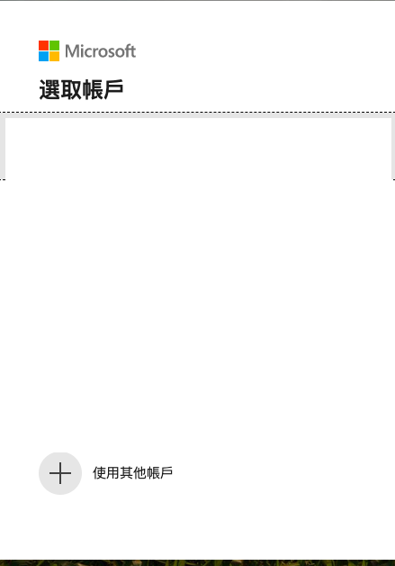

# Predict diabetes disease progression use Machine Learning Service

## Scenario
In this tutorial, you complete the steps to get started with the [Azure Machine Learning](https://docs.microsoft.com/en-us/azure/machine-learning/service/overview-what-is-azure-ml) Python SDK running in Jupyter notebooks,and Python environment setup and configuration, as well as creating a workspace to manage  experiments and **machine learning models**. builds on this to train multiple machine learning models and  model management process using both the Azure portal and the SDK

## Prerequisite

1. Download **diabetes.ipynb** which is in this repository in your computer folder 

## Lab tutorial

### Create a workspace

An Azure Machine Learning workspace is a foundational resource in the cloud that you use to **experiment, train, and deploy machine learning models**.

1. Sign in to the Azure portal ,and in the upper-left corner of Azure portal, select **Create a resource**.

    

2. Use the search bar to find **Machine Learning service workspace**,and click **Select**.

    

3. In the Machine Learning service workspace pane, select **Create Azure machine learning** to begin.

    

4. For Workspace name, type a **Unique Name**

5. For Subscripition, Select **your Subscripition**

6. For Resource group , Select **your Resource group** ,if not have any, Please click **Create New**

7. For Location , Select **Southeast Asia**  

8. For Workspace edition, Select **Baseic**

8. After you are finished configuring the workspace, select **Review+Create**.

    

9. To view the new workspace, select **Go to resource**.

## Clone a notebook folder

You complete the following experiment set-up and run steps in the workspace landing page (preview), a consolidated interface that includes machine learning tools to perform data science scenarios for data science practitioners of all skill levels

1. In the upper-left corner of Azure Machine , Select Overview, and click **Lauch the new Azure Machine Learning studio** 

    

2. Sign in to the workspace landing page.
    * Swith directory: select `Your current Switch directory`

    * Subscription : select `Your Subscription`
    
    * Machine learning workspaces:  select `Your workspace `

    * Click **Get started**

    

3. To view the Microsoft Azure Machine Learning , Select **Notebooks*** on the left
    
    * Open the **samples** folder 

    * Select the "..." at the right of the **tutorials** folder and then select **Clone**

    * Select **your folder** to clone the tutorial folder there.

    *  Click **Clone**

    

    
 

## Select a VM to run the notebook

1. Under **User Files** open your folder and then open the cloned **tutorials** folder.

    

2. Click **upload datasets** 
    * upload **diabetes.ipynb** from  your computer folder
    

    

3.  Select the **diabetes.ipynb** file in your tutorials folder

4.  Select **New VM** to create the VM.

    

4. From Notebook VM
    * Notebook VM name: type `your unique name`
    
    * VM type: Select `STANDARD_DS3V2`
    
    *   Click **Create**

    

## Connect workspace and create experiment

1. Select the "..." at the right of the **Notebook VM** and then select **jupyter**, click **Open in Jupyter**

    

2. Run first code , and **open the page**

    

3. Enter the **code** to authenticate

4. Select **your Azure Account**

    

5. Return Jupyter notebook

    

6. Run code ,  create an experiment in workspace

    

## Load data and prepare for training

 Use the diabetes data set, which is a pre-normalized data set included in scikit-learn. This data set uses features like age, gender, and BMI to predict diabetes disease progression. Load the data from the `load_diabetes()` static function, and split it into training and test sets using train_test_split(). This function segregates the data so the model has unseen data to use for testing following training

 1. Load the data from the `load_diabetes()` static function

    

2.  split it into training and test

    

## Train  a  model

1. Build a script that trains ridge models in a loop through different hyperparameter alpha values.

    

* For each alpha hyperparameter value in the `alphas` array, a new run is created within the experiment. The alpha value is logged to differentiate between each run.

* In each run, a Ridge model is instantiated, trained, and used to run predictions. The `root-mean-squared-error` is calculated for the actual versus predicted values, and then logged to the run. At this point the run has metadata attached for both the alpha value and the rmse accuracy.

* Next, the model for each run is serialized and uploaded to the run. This allows you to download the model file from the run in the portal.

*  At the end of each iteration the run is completed by calling `run.complete()`.

## View training results in portal

Following the Link to **Azure portal** takes  to the main experiment page .

This page makes it easy to see every model trained, specifically how they were trained, and how your unique metrics have changed over time .

    

## Clean up resources

1. Stop the notebook VM

2.  Delete everything