#  The number of bilke count Predict use Machine Learning Studio

## Scenario 
In this Lab ,you build a solution using [Machine Learning Studio](https://docs.microsoft.com/en-us/azure/machine-learning/studio/what-is-ml-studio) that predict Bike count by  **Linear Regression model** for Bike Rental UCI dataset,This dataset contains the hourly and daily count of rental bikes between years 2011 and 2012 in Capital bikeshare system with the corresponding weather and seasonal information.

You will learn predict using Machine Learning to create a model that will predict bikes count and **Deploy model to Web Server**

## Prerequisite
* Download *Bike Rental UCI dataset.csv*  which is in this repository in your computer folder 

## Lab tutorial

### Create Machine Learning service workspaces 
* In Azure Portal Search for **Machine Learning Studio workspaces**, click **Add**.

    

    

* For Workspace name, type a **Unique Name**

 * Select **Resource Group** to organize your resource, if you don't have one, you can create a new resource group.

* For Location, choose `South Central US`

* For Storage account,select **Use Existing** to organize your Storage account,if you don't have one, you can Select a  **Create new**.

* For Workspace pricing tier,Choose `Standard`

* For Web service plan ,Choose `Create new`

* For Web service plan pricing tier,choose `DEVTEST Standard`

    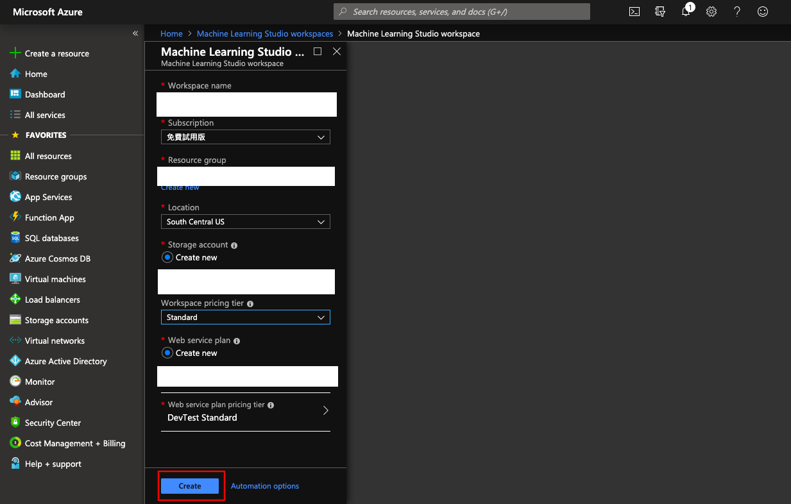

Click **Create** button on lower left side to create Machine Learning studio workspaces  without any setting

### Launch Machine Learning Studio 

* From the list of vitural machine Learning studio workspaces, click **OverView**

* You can see **Additional Links**,Click `Launch Machine Learning Studio`

    

### Create a Machine Learning Studio workspace

* Connect to **Azure Machine Learning Studio** Page

    

* Select your workspace in the upper-right-hand corner. 

    

* Click **Sign In**

### Upload a datasets
* Clicking **+NEW** at the bottom of the Machine Learning Studio window. 

    

* Select **Datasets**

* Click **FROM LOCAL FILE** Upload a new dataset from a local file

    

* On select the data to upload,cilck **Choose File**,upload `Bike Rental UCI dataset.csv`

* Enter a name for the dataset. For this tutorial, call it **Bike Rental UCI Data**

* For data type, select **Generic CSV File With no header (.nh.csv)**

    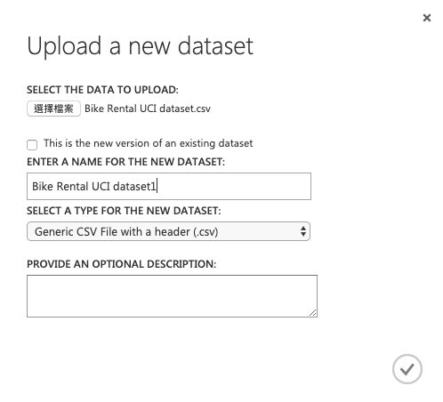

* Click the **OK** check mark

### Create an experimen

* In Studio, click **+NEW** at the bottom of the window.

    

* Select **EXPERIMENT**, and then select **Blank Experimen**

    

* Select the default experiment name at the top of the canvas and rename **Bike count Predict**

    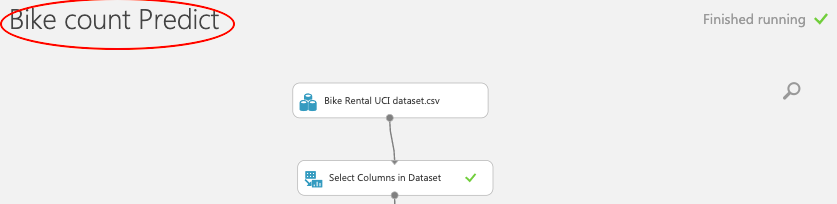

* In the module palette to the left of the experiment canvas, click **Saved Datasets**

    

* Find the dataset you created under **My Datasets** and drag it onto the canvas,Select **Bike Rental UCI dataset.csv**

    

## Feature Engineering
[Feature engineering](https://en.wikipedia.org/wiki/Feature_engineering) is the process of using **domain knowledge** of the data to create features that make machine learning algorithms work

* Click the output port of the **dataset** and select **Visualize**

    

 

    

* You can view the first 100 rows of the data and some statistical information for the whole dataset

*  In the module palette to the left of the experiment, type **Select Columns in Dataset** in the Search box. The Select Columns appears in the module list 

* Click and drag the **Select Columns in Dataset**  module onto the canvas and drop it below the dataset you added earlier

    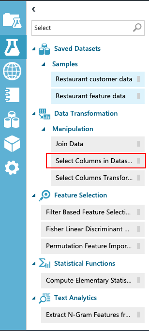

* Click the output port of the dataset  drag to the input port of **Select Columns in Dataset**

    

* click **Select Columns in Dataset** , and in the Properties pane to the right of the canvas, click **Launch column selector**.

    

* In the **Select columns** dialog  Select **With Rules** 
    
    * Begin With :**ALL Columns**, and Seclect **Exclude** ,**column names**

    * Enter column name: `instant` , `detday`, `yr`, `casual`

 

    

* Click the **OK** check mark

### Edit Metadata

The values and the data types in the dataset are not actually altered; what changes is the [metadata](https://docs.microsoft.com/en-us/azure/machine-learning/studio-module-reference/edit-metadata) inside Azure Machine Learning that tells downstream components how to use the column

* In the module palette, type **metadata** in the Search box

    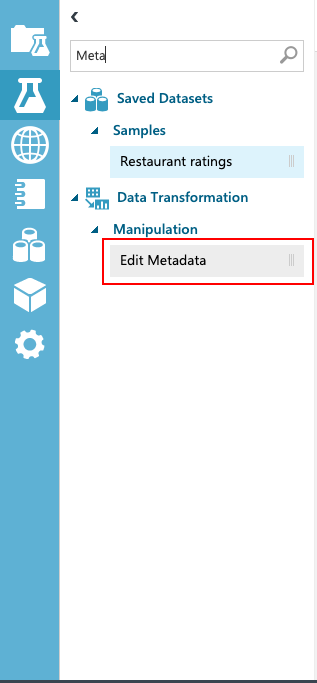

* Click and drag the **Edit Metadata** module on to the canvas and drop it below the dataset you added earlier

* Click the output port of the  **Select columns in Dataset**, drag to the input port of **Edit Metadata**

    

* Select **Edit Metadata**, and in the Properties pane to the right of the canvas, click **Launch column selector**

    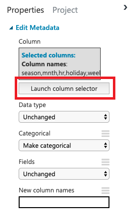

* In the **Select columns** dialog  Select **With Rules** 
    
    * Begin With :**No Columns**, and Seclect **Include** ,**column names**

    * Enter column name: `Season` `mnth` `hr` `holiday` `weekday` `workingday` `weathersit`

    

* Click the **OK** check mark

* Data type:`Unchange`

* Categorical:`Make categorical `

* Fields:`Unchange`

    

* Click **RUN** under of the experiment
### Create training and test datasets

* Find the **Split Data** module, drag it onto the canvas, and connect it to the **Edit Metadata** module

    

* in the Properties pane to the right of the canvas, click:

    * Split model:`Spilt Rows`

    * Fraction of rows in the first output dataset:`0.7`

    * Random seed: `0`

    * Stratified split:`False`

    

    

* Click **RUN**  under of the experiment

### Train Model 
The **Train Model** in Azure Machine Learning Studio to train a classification or regression model. Training takes place after you have defined a model and set its parameters, and requires tagged data.

* In the module palette, expand the **Machine Learning** categoryto the left of the canvas 

* Expand Initialize Mode

* select the **Linear Regression** module under the **Regression category**, and drag it to the experiment canvas

    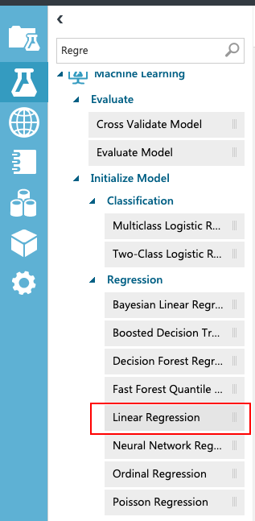

* Find and drag the Train Model module to the experiment canvas. Connect the output of the **Linear Regression** module to the left 

* Input of the Train Model module, and connect the output of the **Split Data**  to the right input of the **Train Model**

    

* Click the **Train Model**, click **Launch column selector** in the Properties pane  

* Select the **Cnt** column. **cnt** is the value that our model is going to predict

* Select the **cnt** column in the column selector by moving it from the **Available columns** list to the **Selected columns list**

    

* **Run** the experiment

    

### Score and evaluate the models
 Use the testing data that was separated out by the Split Data module to score our trained models. you can then compare the results of the two models to see which generated better results

 Now that we've trained the model using 70 percent of our data, we can use it to score the other 30 percent of the data to see how well our model functions.

*  Find and drag the **Score Model**  to the experiment canvas

    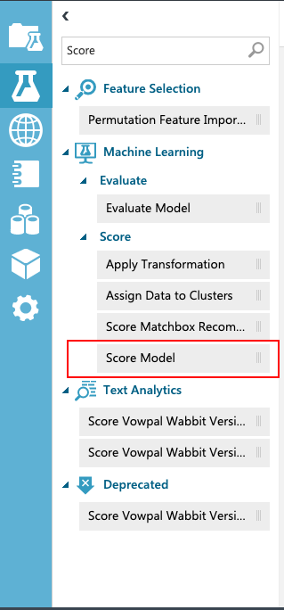

* Connect the output of the **Train Model**  to the **left input port** of Score Model

* Connect the **test data output (right port) of the Split Data** module to the **right input port** of Score Model

    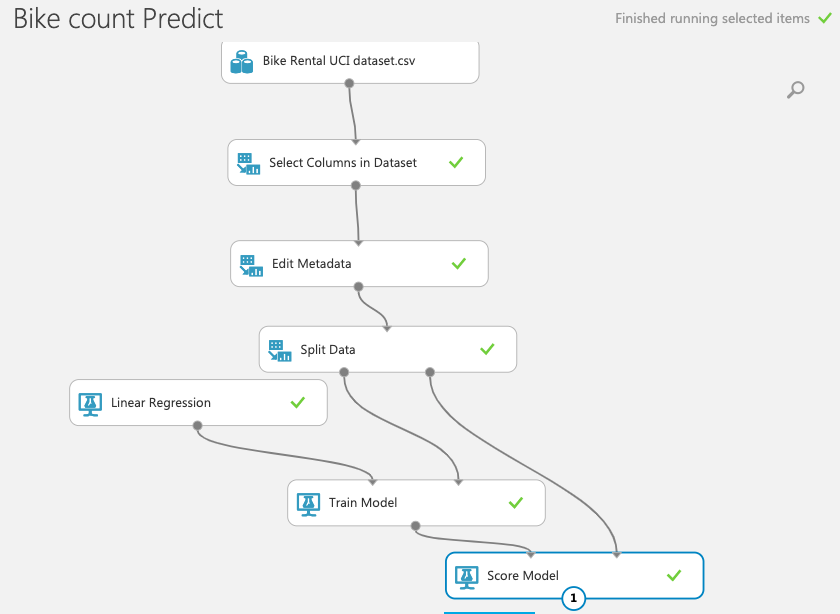

* **Run** the experiment and view the output from the Score Model

* Clicking the output port of Score Model and select **Visualize**

    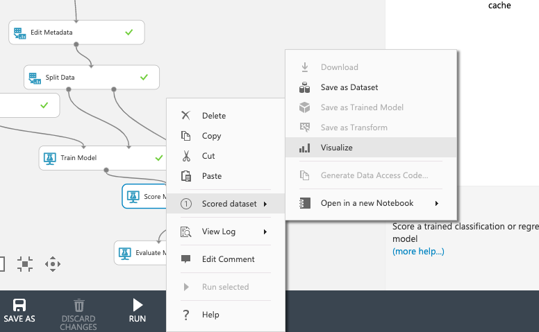

    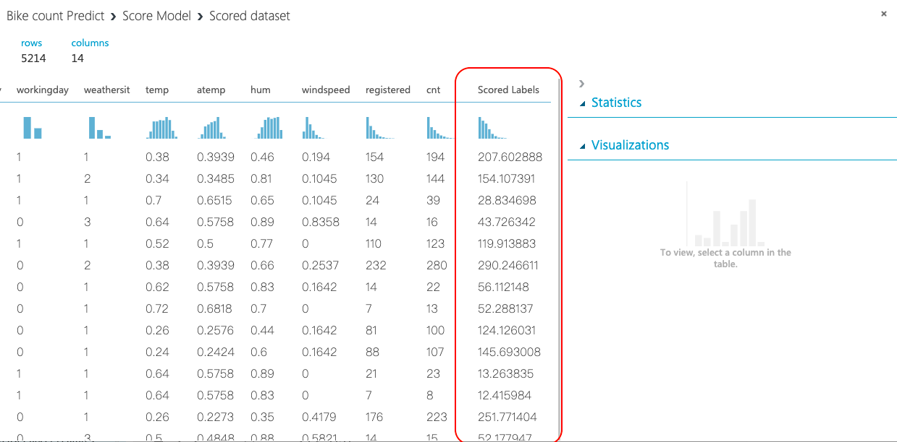

* The output shows the predicted values for **cnt** and the known values from the test data

####  Evaluate Model

* Find the **Evaluate Model** module and drag it onto the canvas

    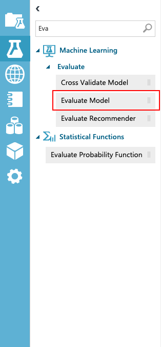

* Connect the output of the **Score Model**  to the **left input** of Evaluate Model

    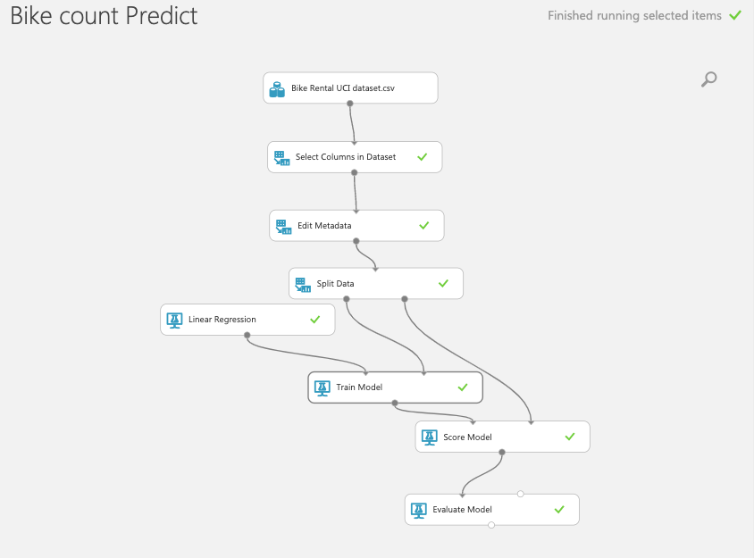

* **Run** the experiment

* View the output from the **Evaluate Model** , click the output port, and then select **Visualize**

    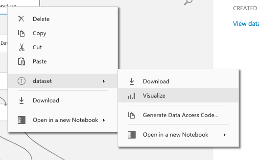

    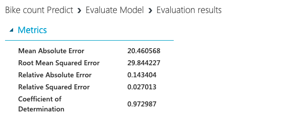

    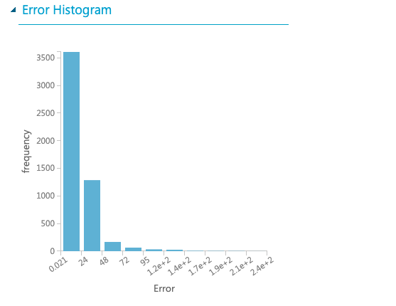

*  Following statistics are shown for our model:

    * **Mean Absolute Error (MAE)**: The average of absolute errors (an error is the difference between the predicted value and the actual value)

    * **Root Mean Squared Error (RMSE)**:The square root of the average of squared errors of predictions made on the test dataset.

    * **Relative Absolute Error**: The average of absolute errors relative to the absolute difference between actual values and the average of all actual values

    * **Relative Squared Error**: The average of squared errors relative to the squared difference between the actual values and the average of all actual values

    * **Coefficient of Determination**: Also known as the **R squared** value, this is a statistical metric indicating how well a model fits the data

### Prepare for deployment
To give others a chance to use the predictive model you've developed in this tutorial, you can deploy it as a web service on Azure.
* Convert the training experiment you've created into a predictive experiment

* Deploy the predictive experiment as a web service

### Convert the training experiment to a predictive experiment

To get this model ready for deployment, you need to convert this training experiment to a predictive experiment. This involves three steps

* Click **Set Up Web Service**,Select **Predicture Web Service**

    

* Modules that were used for training are removed:

    * Split Data

    * Train Model

    * Linear Regression model

    * Evaluate Model

* The saved trained model is added back into the experiment

* Web service input and Web service output modules are added

    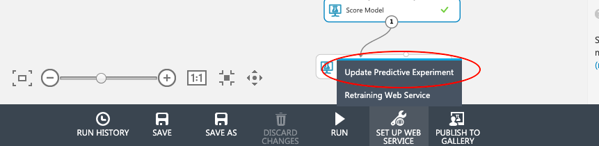

* **Run** the experiment

### Deploy a web service

* Click **Deploy Web Service** below the canvas 

    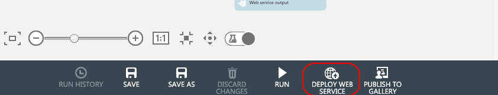

* Select **New Web Services Experience** 

    

* Transfers to the **Azure Machine Learning web services Deploy Experiment page**

    

### Test  web service

* In the Azure Machine Learning Web Services portal, click **Test** at the top of the page
    
    * These are the same columns that appeared in the original credit risk dataset

* Click **Test Request-Response**

    

### Clean up resources
In the resource group,**Delete resource**

* Machine Learning Studio workspaces

* Machine Learning Studio web Service Plan

* Storage Account

### Conclusion

Congratulations! You now have learned how to:

* Use Machine Learning Studio

* Build a Machine Learning Model as can **Perdict** 

* About Big Data Process and  Analysis Knowledge

* Deploy model to Web Services

